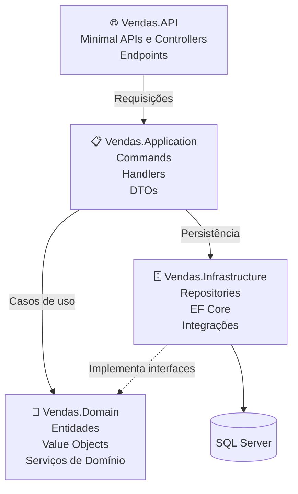
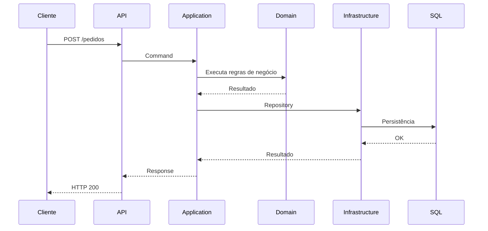

# Sistema de Vendas • ASP.NET Core + DDD


Projeto desenvolvido com o objetivo de estudar e aplicar os conceitos de **Domain-Driven Design (DDD)** com **ASP.NET Core**, implementando uma arquitetura em camadas e validando as regras de negócio através de testes automatizados..

Mais do que implementar um sistema de vendas, o foco foi compreender como organizar aplicações complexas utilizando uma arquitetura em camadas, mantendo o domínio como o centro da solução.

---

# 📖 Sobre o projeto

Este projeto simula uma API para gerenciamento de vendas utilizando conceitos modernos de arquitetura de software.

Durante seu desenvolvimento foram aplicados princípios como:

- Domain-Driven Design (DDD)
- Repository Pattern
- Dependency Injection
- Separação de responsabilidades
- Arquitetura em camadas
- Inversão de Dependência
- Organização do domínio independente da infraestrutura
- Fundamentos de Clean Architecture

O principal objetivo foi aprender como aplicações reais podem ser estruturadas para facilitar manutenção, evolução e escalabilidade.

---

# 🏛 Arquitetura

O projeto foi organizado seguindo os princípios do **Domain-Driven Design (DDD)**, mantendo cada camada responsável por uma única função dentro da aplicação.



## Responsabilidade das camadas

| Camada | Responsabilidade |
|---------|------------------|
| **Vendas.API** | Expõe os endpoints da aplicação através de Minimal APIs e de Controllers. |
| **Vendas.Application** | Orquestra os casos de uso, comandos e comunicação entre as camadas. |
| **Vendas.Domain** | Contém as regras de negócio, entidades, objetos de valor e contratos. |
| **Vendas.Infrastructure** | Implementa persistência, repositórios e integrações utilizando Entity Framework Core. |

Essa organização reduz o acoplamento entre as camadas e facilita a manutenção da aplicação.

---

# 🔄 Fluxo de uma requisição

O diagrama abaixo representa o fluxo simplificado de uma operação dentro da aplicação.



---

# 🚀 Tecnologias utilizadas

- ASP.NET Core
- C#
- Entity Framework Core
- SQL Server
- Minimal APIs
- Domain-Driven Design (DDD)
- Repository Pattern
- Swagger / OpenAPI
- Dependency Injection

---

# 📂 Estrutura do projeto

```
Sistema-Vendas-DDD
│
├── Vendas.API
│   ├── Endpoints
│   └── Program.cs
│
├── Vendas.Application
│   ├── Commands
│   ├── DTOs
│   ├── Interfaces
│   └── Services
│
├── Vendas.Domain
│   ├── Entities
│   ├── Enums
│   ├── Exceptions
│   ├── Services
│   └── ValueObjects
│
├── Vendas.Infrastructure
│   ├── Persistence
│   ├── Repositories
│   └── Integrations
│
└── Vendas.Domain.Tests
    ├── Entities
    ├── ValueObjects
    └── Services
```

---

# 📌 Funcionalidades

O projeto contempla funcionalidades relacionadas ao processo de vendas, incluindo:

- Cadastro de categorias
- Cadastro de produtos
- Cadastro de clientes
- Criação de pedidos
- Adição de itens ao pedido
- Início do pagamento
- Confirmação de pagamento
- Cancelamento de pedidos
- Integrações simuladas para representar serviços externos

---

# 🧪 Testes automatizados

O projeto possui uma suíte de testes automatizados concentrada no projeto **Vendas.Domain.Tests**, com foco na validação das regras de negócio da camada de domínio.

Ao manter os testes no domínio, é possível validar a lógica da aplicação de forma isolada, sem depender de banco de dados ou da infraestrutura.

Os testes cobrem cenários como:

- Validação de entidades
- Regras de negócio
- Objetos de Valor (Value Objects)
- Serviços de domínio
- Casos de sucesso e exceções

Para executar os testes:

```bash
dotnet test
```

---

# ▶ Como executar

## Clonar o repositório

```bash
git clone https://github.com/Augusto-LJ/sistema-vendas-ddd.git
```

## Entrar na pasta

```bash
cd sistema-vendas-ddd
```

## Restaurar dependências

```bash
dotnet restore
```

## Executar a aplicação

```bash
dotnet run --project Vendas.API
```

Após iniciar a aplicação, acesse:

```
https://localhost:5226/swagger
```

---

# 🎯 Objetivos do projeto

Este projeto foi criado para:

- Aprender Domain-Driven Design
- Aplicar arquitetura em camadas
- Melhorar a organização do código
- Separar regras de negócio da infraestrutura
- Explorar boas práticas de desenvolvimento em ASP.NET Core

---

# 📚 O que aprendi

Durante o desenvolvimento deste projeto pude compreender, na prática, diversos conceitos do **Domain-Driven Design**, principalmente como estruturar aplicações que sejam organizadas, desacopladas e preparadas para crescer.

Os principais aprendizados foram:

- Modelagem do domínio baseada nas regras de negócio.
- Separação entre API, Aplicação, Domínio e Infraestrutura.
- Utilização de Entidades e Value Objects.
- Repository Pattern.
- Inversão de Dependência.
- Organização das responsabilidades entre as camadas.
- Centralização das regras de negócio no domínio.
- Uso de interfaces para reduzir acoplamento.
- Aplicação de boas práticas de arquitetura utilizadas em projetos corporativos.
- Escrita de testes unitários e de integração focados na camada de domínio.
- Validação das regras de negócio de forma isolada.
- Importância dos testes para garantir a consistência do modelo de domínio.

Mais do que construir um sistema de vendas, este projeto representou um laboratório para consolidar conceitos de arquitetura que pretendo continuar utilizando em projetos futuros.

---

# 🔮 Melhorias futuras

Algumas funcionalidades que podem ser implementadas futuramente:

- Autenticação e autorização
- Docker
- Pipeline de CI/CD
- CQRS completo
- FluentValidation
- Logging estruturado
- Cache
- Versionamento da API

---

# ⭐ Considerações finais

Este projeto foi desenvolvido com foco em aprendizado e prática de **Domain-Driven Design (DDD)**.

Embora seja um projeto de estudos, procurei aplicar conceitos e padrões utilizados em aplicações corporativas, buscando escrever um código organizado, desacoplado e de fácil manutenção.

A experiência adquirida durante seu desenvolvimento foi fundamental para consolidar conhecimentos sobre arquitetura de software e compreender melhor como estruturar aplicações orientadas ao domínio.
